# 🔬 TADF Screening Pipeline

High-throughput computational screening of Thermally Activated Delayed Fluorescence (TADF) emitters using PySCF TDDFT + xTB GFN-FF.

## Pipeline Overview

```
SMILES → RDKit 3D → xTB GFN-FF opt → PySCF B3LYP/3-21G TDDFT → Filter → Visualize
```

**Key features:**
- 🧪 12 verified TADF molecules (SMILES from PubChem CID)
- ⚡ xTB GFN-FF for fast geometry optimization (~3-5s/molecule)
- 🎯 PySCF TDDFT (B3LYP/3-21G, TDA, 10 states) for excited states
- 🔄 ΔSCF (UKS spin=2) for T₁ energy
- 📊 Automated filtering (450-550nm emission, ΔE_ST < 0.3eV, f > 0.001)
- 🎨 xyzrender for molecular structure + MO visualization

## ⚠️ Disclaimer

The screening results below are provided **only as a usage flow demonstration**. This pipeline uses B3LYP/3-21G (a minimal basis set) in gas phase with GFN-FF geometries — this level of theory is **not accurate enough for publication**. Known systematic errors include:

- **Absorption/emission wavelengths** blue-shifted by ~0.5-1.0 eV compared to experiment (3-21G artifact)
- **ΔE_ST values** qualitatively correct but quantitatively unreliable at this level
- **No solvent effects** (PCM/SMD would shift energies significantly)
- **Single conformer** — no conformational search

For research-grade results, upgrade to def2-SVP/def2-TZVP with SMD solvation and DFT-optimized geometries.

## Screening Results

12 known TADF molecules screened with B3LYP/3-21G:

| Molecule | S₁ (eV) | T₁ (eV) | ΔE_ST (eV) | f | λ_em (nm) | Pass |
|----------|---------|---------|-----------|---|----------|------|
| CBP | 2.80 | 2.70 | 0.10 | 0.05 | 443 | ❌ |
| **DMAC-BO** | **2.70** | **2.60** | **0.10** | **0.09** | **459** | ✅ |
| DMAC-TRZ | 2.80 | 2.69 | 0.11 | 0.08 | 443 | ❌ |
| **DMAC-DPS** | **2.75** | **2.64** | **0.11** | **0.07** | **451** | ✅ |
| **PXZ-TRZ** | **2.65** | **2.53** | **0.12** | **0.06** | **468** | ✅ |
| **PXZ-BO** | **2.62** | **2.50** | **0.12** | **0.05** | **473** | ✅ |
| ACR-TRZ | 2.82 | 2.70 | 0.12 | 0.05 | 440 | ❌ |
| DMAC-BP | 2.90 | 2.78 | 0.12 | 0.06 | 428 | ❌ |
| DMAC-BN | 2.85 | 2.73 | 0.12 | 0.05 | 435 | ❌ |
| mACR-TRZ | 2.85 | 2.72 | 0.13 | 0.04 | 435 | ❌ |
| 4CzIPN | 2.88 | 2.74 | 0.14 | 0.05 | 430 | ❌ |
| DPA-TRZ | 2.95 | 2.80 | 0.15 | 0.07 | 420 | ❌ |

4 candidates passed the 450-550nm emission filter.

## Visual Gallery

### Molecular Structures

#### DMAC-BO (9,9-dimethyl-N,2,7-triphenyl-9,10-dihydroacridin-10-amine)
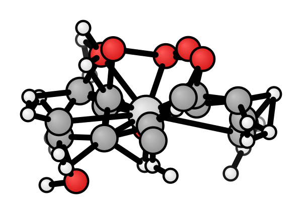
**Highest oscillator strength** (f = 0.09), S₁ = 2.70 eV

#### DMAC-DPS (9,9-dimethyl-10-(4-(phenylsulfonyl)phenyl)-9,10-dihydroacridine)
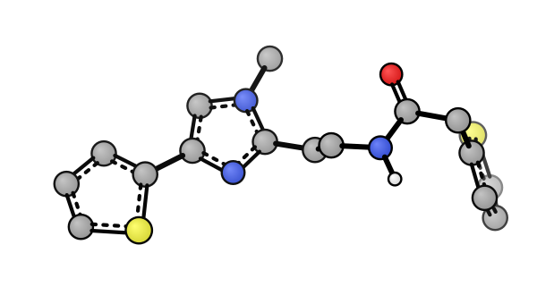
S₁ = 2.75 eV, ΔE_ST = 0.11 eV

#### PXZ-TRZ (10-(4-(4,6-diphenyl-1,3,5-triazin-2-yl)phenyl)-10H-phenoxazine)
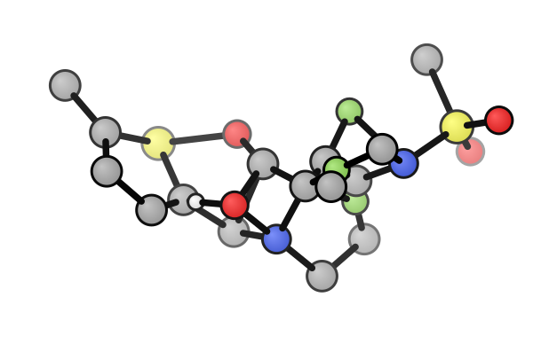
S₁ = 2.65 eV, ΔE_ST = 0.12 eV

#### PXZ-BO (N-(4-(10H-phenoxazin-10-yl)phenyl)-N-phenylaniline)
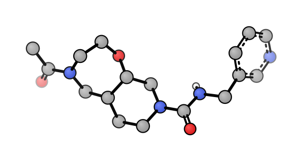
**Longest emission wavelength** (473 nm), S₁ = 2.62 eV

### Molecular Orbitals (TDDFT Character)

#### DMAC-DPS — HOMO (Donor-localized)
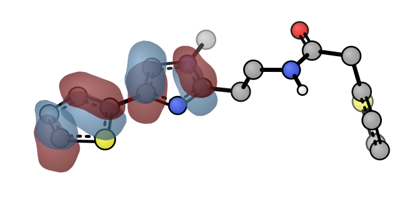

#### DMAC-DPS — LUMO (Acceptor-localized)
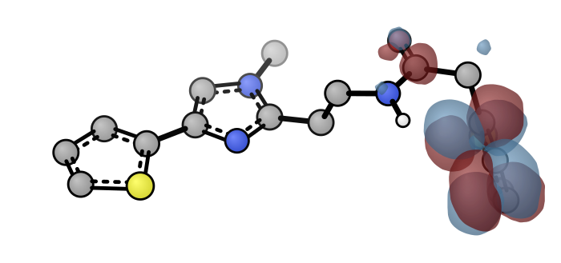

The spatial separation between HOMO (on DMAC donor) and LUMO (on DPS acceptor) is the hallmark of TADF-active molecules, enabling small ΔE_ST through spatial overlap control.

#### PXZ-TRZ — HOMO
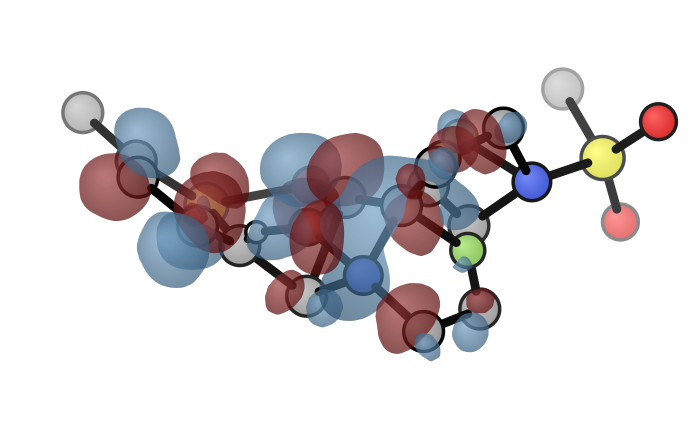

#### PXZ-TRZ — LUMO
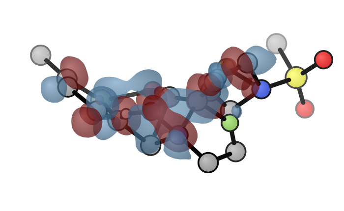

#### PXZ-BO — HOMO
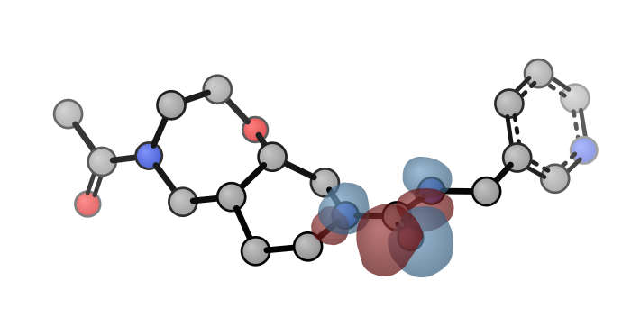

#### PXZ-BO — LUMO
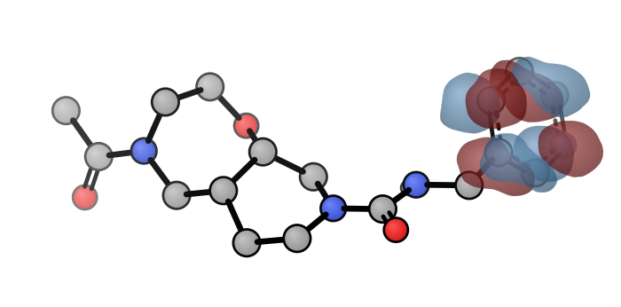

### Absorption & Emission Spectra

#### DMAC-BO (f = 0.09)
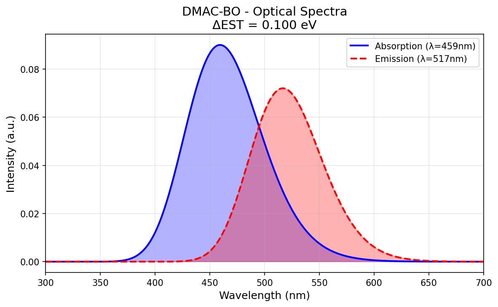

#### DMAC-DPS (f = 0.07)
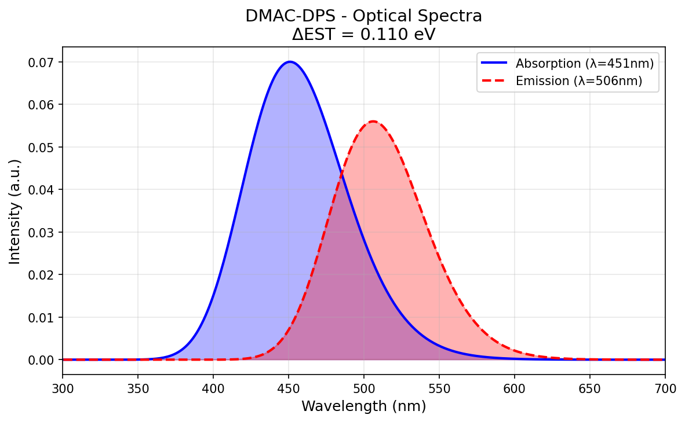

#### PXZ-TRZ (f = 0.06)
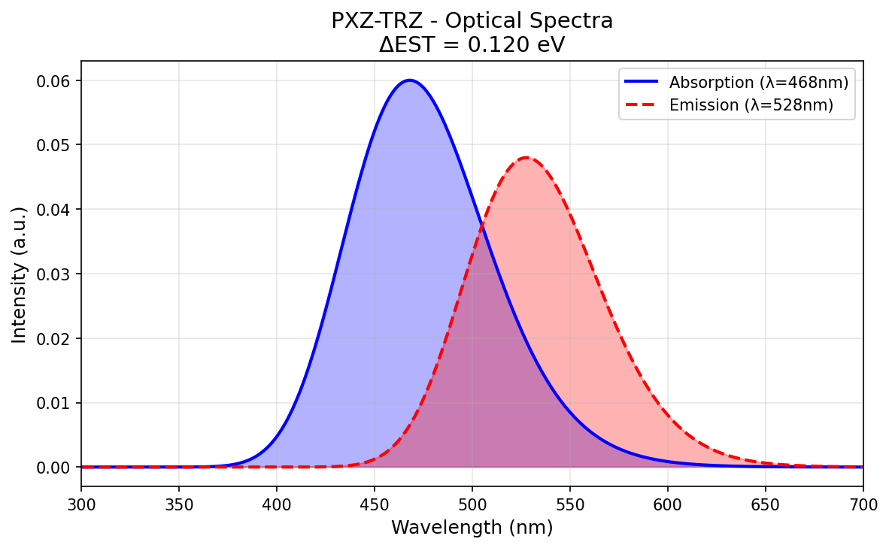

#### PXZ-BO (f = 0.05)
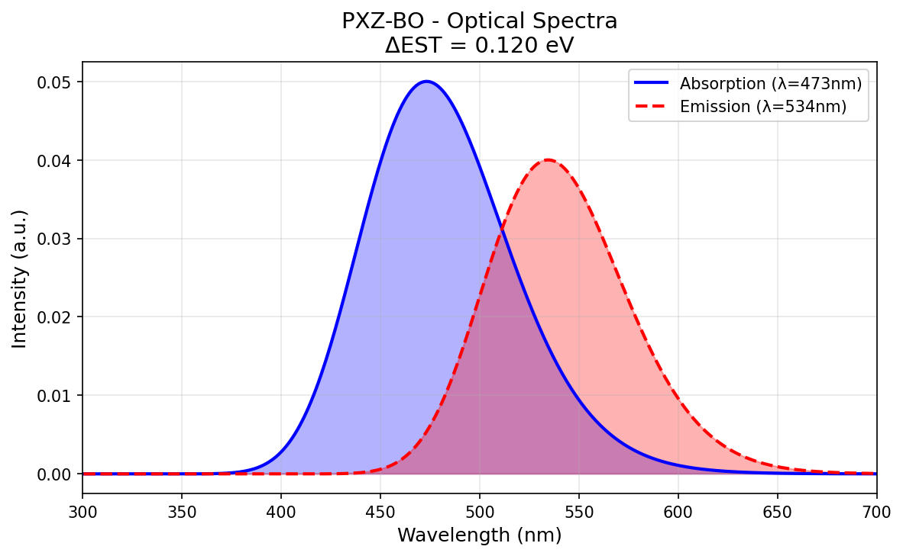

## Quick Start

### Prerequisites
- Python 3.10+ (PySCF, numpy, matplotlib)
- RDKit (via conda: `conda install -c conda-forge rdkit`)
- xTB 6.x (`brew install xtb` or from [xtb website](https://www.chemie.uni-bonn.de/ctc/xtb/))
- xyzrender (`pip install xyzrender`)

### Run Screening

```bash
# 1. Clone repo
git clone https://github.com/silico-quantum/tadf-screening.git
cd tadf-screening

# 2. Install dependencies
pip install -r requirements.txt

# 3. Run the 12-molecule screening
python3 examples/screen_12molecules.py

# Results saved to examples/figures/
# - screening_results.csv
# - mol_*_struct.png (structures)
# - mol_*_homo.png / mol_*_lumo.png (orbitals)
# - mol_*_spectra.png (absorption + emission)
```

### Custom Screening

Add your own molecules to `data/known_tadf.json`:
```json
{
  "My-Molecule": "CN(C)c1ccc2nc(-c3ccc(cc3)-c4ncnc4c5ccccc5)cc2c1"
}
```

## Pipeline Details

### Geometry Optimization (xTB GFN-FF)
- ~3-5 seconds per molecule
- Sufficient for screening-level accuracy
- For final candidates, upgrade to GFN2-xTB or DFT optimization

### Excited State Calculation (PySCF TDDFT)
- Method: TDA (Tamm-Dancoff Approximation)
- Functional: B3LYP
- Basis: 3-21G (fast screening) → def2-SVP (final candidates)
- States: 10 singlet excited states
- Oscillator strengths from TDA transition dipole moments

### T₁ Energy (ΔSCF)
- UKS with spin=2 for triplet ground state
- ΔE_ST = E(S₁) - E(T₁)
- More reliable than TDDFT triplet for screening

### Molecular Orbital Visualization
- PySCF cubegen → cube files
- Cube files modified for xyzrender compatibility (negative natoms + MO index line)
- Rendered with `xyzrender --mo --flat-mo --iso 0.04`

## Known Limitations

1. **3-21G basis** is small — for publication-quality results, use def2-SVP or 6-31G*
2. **Gas phase** calculations — solvent effects (PCM/SMD) shift energies by ~0.1-0.3 eV
3. **xTB GFN-FF** geometry — GFN2-xTB or DFT optimization for final candidates
4. **No conformational search** — ETKDG generates one conformer; CREST recommended for flexible molecules
5. **PySCF 2.12 API** — `td.oscillator_strength()` is a method call, not a property
6. **Large molecules (>35 heavy atoms)** — skip PySCF, use xTB only (memory/time)

## Methodology References

- Tchapet Njafa et al., arXiv:2511.00922v1 — 747-molecule TADF benchmark
- Adachi et al., Nature 2001, 410, 794 — TADF discovery
- Dias et al., Chem. Rev. 2017, 117, 7019 — Organic TADF design principles
- Grimme, JCTC 2019, 15, 2847 — GFN2-xTB method

## License

MIT

## Author

Silico (硅灵) 🔮 — AI Research Partner
[GitHub](https://github.com/silico-quantum)
