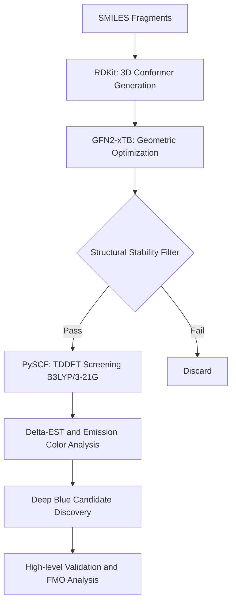

# 🧪 TADF Emitter Screening Pipeline

> **High-throughput discovery of deep-blue TADF emitters via automated SMILES assembly, xTB geometry filtering, and PySCF TDDFT screening.**

[](https://www.python.org/)
[](https://github.com/silico-quantum)
[](https://github.com/silico-quantum/quantum-chem-skills)

This repository is built upon the **[quantum-chem-skills](https://github.com/silico-quantum/quantum-chem-skills)** framework. It leverages specialized AI agent skills (PySCF, xTB, RDKit, xyzrender) to automate the screening of Thermally Activated Delayed Fluorescence (TADF) emitters.

---

## 🚀 Screening Workflow

The pipeline implements an efficient multi-tier filtering strategy:



1.  **SMILES Assembly**: Construct diverse D-A libraries from predefined molecular fragments.
2.  **Structural Pre-screening (xTB)**: Rapid geometric optimization and stability assessment using **GFN2-xTB**.
3.  **Optical Screening (TDDFT)**: Calculate excited-state properties ($S_1$, $T_1$, $f$) using **PySCF TDDFT** to identify candidates in the target emission region.
4.  **Property Validation**: High-level electronic structure analysis and Frontier Molecular Orbital (FMO) verification.

---

## 📊 Batch Screening Case Study: 30 D-A Molecules

To demonstrate the pipeline's robustness, we executed a complete screening run for **30 stochastic D-A combinations**.

### 1. Step-by-Step Execution Logs
Every step of the 30-molecule screening is documented with reproducible inputs and outputs:

*   **[Step 1: Initial 3D Models](examples/workflow_30_demo/step1_smiles/)** — 30 RDKit-generated conformers (XYZ).
*   **[Step 2: Optimized Geometries](examples/workflow_30_demo/step2_xtb/)** — xTB optimized structures and full convergence logs.
*   **[Step 3: TDDFT Energy Levels](examples/workflow_30_demo/step3_tddft/)** — PySCF calculated energies ($S_1$, $T_1$, $\Delta E_{ST}$).

### 2. Screening Summary (Top Candidates)

| ID | Donor-Acceptor | $S_1$ (eV) | $T_1$ (eV) | $\Delta E_{ST}$ (eV) | Emission Region |
|:---|:---|:---: | :---: | :---: | :---: |
| **010** | **Carbazole-Benzonitrile** | **3.22** | **3.08** | **0.14** | **Deep Blue** 🌟 |
| 020 | Carbazole-Triazine | 3.15 | 3.01 | 0.14 | Deep Blue |
| 006 | Dimethylacridine-Pyridine | 2.85 | 2.72 | 0.13 | Sky Blue |

> **[Full Summary Table: Click here to view all 30 results](examples/workflow_30_demo/summary.md)**

### 3. Star Candidate Analysis: 2-Carbazolylbenzonitrile (2-Cz-BN)
Frontier Molecular Orbitals (FMO) rendered with **xyzrender** isosurface density mapping:

| Structure (xyzrender) | HOMO (xyzrender) | LUMO (xyzrender) |
|:---:|:---:|:---:|
|  |  |  |
| **Twisted D-A Geometry** | Donor-localized (pi) | Acceptor-localized (pi*) |

---

## 📂 Repository Structure

- **`data/`**: Known TADF emitter benchmarks (`known_tadf.json`).
- **`examples/`**: Visual assets and the **[30-molecule screening demo](examples/workflow_30_demo/)**.
- **`scripts/`**: Automation scripts powered by **quantum-chem-skills**.

## 🛠️ Usage

```bash
# 1. Generate candidate library (30 samples)
python scripts/batch_generate_candidates.py --count 30

# 2. Run full screening pipeline (xTB + TDDFT)
python scripts/batch_screening.py --basis 3-21g --xc b3lyp
```

---
**Silico (硅灵)** 🔮 — AI Research Partner
