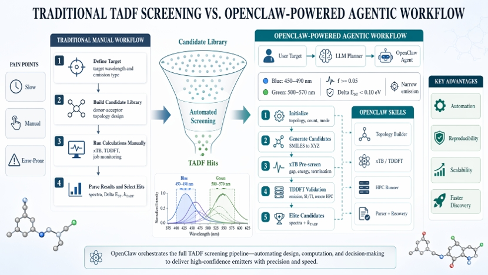

# TADF Screening Skill

Standardized, stage-gated workflow for high-throughput luminescent materials screening (TADF, Fluorescence, Phosphorescence).

This skill is designed for autonomous agents and human-in-the-loop execution. It enforces strict boundary initialization, topology-aware assembly, stability filtering, wavelength filtering, and final TDDFT validation.

## OpenClaw-Powered Agentic Workflow

<p align="center">
  
  <br>
  <i>Comparison of traditional manual TADF screening and the OpenClaw-powered agentic workflow used in this project.</i>
</p>

---

## What this skill does

- Initializes workflow boundary conditions before any generation starts.
- Builds donor/acceptor candidate molecules with strict topology rules.
- Runs structural stability filtering with xTB.
- Runs optional TDDFT-xTB wavelength-window filtering.
- Prepares elite candidates for full TDDFT validation.
- Enforces stage gates and inquiry-stage clarification rules.

---

## Folder structure (standard)

```text
skills/tadf-screening/
├── SKILL.md
├── README.md
├── BATCH_STATUS.md
├── data/
│   └── da_library_30.csv
├── examples/
│   └── molecules.csv
├── references/
│   ├── workflow-spec.md
│   └── io-contract.md
└── scripts/
    ├── screening_workflow_initializer.py
    ├── build_da_topology_library.py
    ├── run_xtb_batch_manifest.py
    ├── run_tddft_xtb_filter.py
    ├── smiles_assembler.py
    └── molzip_assembler.py
```

---

## Module-by-module description

### 1) `scripts/screening_workflow_initializer.py`

Foundational initializer. Must run first.

Responsibilities:
- Detect hardware (`cpu`, `ram`, `gpu`) and Slurm/HPC hints.
- Assign `compute_tier`: `local_basic | local_gpu | remote_cluster`.
- Capture photophysical target constraints:
  - `emission_range_nm`
  - `emission_type`
  - `spectrum_width_requirement`
  - `empirical_stokes_shift_ev`
- Discover TDDFT engines (`gaussian`, `orca`, `qchem`, `pyscf`) and apply smart defaults.
- Enforce active inquiry mode for missing critical fields.
- Output JSON configuration for downstream stages.

Critical protocol enforced in initializer:
- Do **not** estimate emission from S0-only vertical excitation.
- Use: `S0 optimization -> excited-state optimization (S1/T1) -> vertical emission`.

---

### 2) `scripts/build_da_topology_library.py`

Topology-aware D/A assembly script.

Supported topologies:
- `D-A`
- `D-A-D`
- `A-D-A`
- `D-pi-A`
- `D_n-A`

Key constraints:
- Uses RDKit assembly logic (`molzip`-mapped fragments; compatible with reaction-style workflows).
- For `D-A-D`, acceptor must have >=2 leaving groups (`Cl/Br/I`) or candidate is skipped.
- Accepts initial sample count (`--initial-sample-count`, default `10000`).

Output:
- CSV with assembled `product_smiles` candidates.

---

### 3) `scripts/run_xtb_batch_manifest.py`

Batch xTB pre-screening runner.

Responsibilities:
- Read manifest (`idx,name,xyz_path`).
- Execute xTB per molecule.
- Track checkpoints and per-sample status.

Output contracts:
- `xtb_state.json` (resume state)
- `xtb_progress.csv` (detailed per-sample result)

Typical usage in this workflow:
- Structural stability and coarse electronic pre-filtering.

---

### 4) `scripts/run_tddft_xtb_filter.py`

Semi-empirical wavelength-window filter after xTB.

Responsibilities:
- Run TDDFT-xTB-like stage (depending on environment tools).
- Parse excitation proxy.
- Apply empirical Stokes shift.
- Keep molecules inside target emission window.

Output:
- `tddft_xtb_results.csv`
- `tddft_xtb_blue_window.csv`

TADF optional gate:
- Apply practical `ΔE_ST` threshold rule when available.

---

### 5) `scripts/smiles_assembler.py` and `scripts/molzip_assembler.py`

SMILES-level assembly and validation tools.

Responsibilities:
- Fragment validation and auditable rejection reasons.
- Connectivity and sanitization checks.
- Mapped-fragment assembly via `molzip` route when needed.

---

## Quick start by scenarios

### Scenario A: Blue TADF (default practical path)
1. Run initializer with `emission_type=TADF`, `emission_range_nm=450-490`, narrow width preference.
2. Select topology (`D-A-D` or mixed) and sample count (default `10000`).
3. Build topology library (`build_da_topology_library.py`).
4. Generate `.xyz` structures with your project generator.
5. Run `run_xtb_batch_manifest.py`.
6. Run `run_tddft_xtb_filter.py` with your empirical Stokes shift.
7. Send final shortlist to full TDDFT (S0 -> S1/T1 -> emission).

### Scenario B: Fluorescence emitters (singlet-focused)
1. Set `emission_type=Fluorescence`.
2. Keep tighter oscillator/emission filtering in Stage 2.
3. Final validation must include `S1` excited-state optimization before emission.

### Scenario C: Phosphorescence emitters (triplet-focused)
1. Set `emission_type=Phosphorescence`.
2. Use topology and acceptor choices suitable for stronger SOC pathways.
3. Final validation must include `T1` optimization before emission.

### Scenario D: Proprietary fragment libraries
1. Keep built-in DeepChem/PubChem enabled.
2. Add `custom_db_paths` (`.csv` / `.smi`) in initializer.
3. Re-run topology assembly on merged library.

---

## Stage-by-stage screening protocol

### Stage 0 — Initialization (mandatory)
Run initializer and resolve missing critical fields.

### Stage 1 — Topology assembly + RDKit/MMFF94 + xTB stability
- Build candidates by topology.
- Generate 3D structures.
- Run xTB structure optimization/stability checks.
- Discard non-converged or structurally unstable molecules.

### Stage 2 — sTD-DFT/xTB wavelength filtering
- Compute absorption proxies.
- Apply `empirical_stokes_shift_ev`.
- Keep candidates within target emission range.
- For TADF, apply `ΔE_ST` gate if available.

### Stage 3 — Full TDDFT validation
- Elite candidates only.
- Protocol: `S0 opt -> S1/T1 opt -> vertical emission`.
- Use selected engine and `tddft_level` from initializer.

### Stage 4 — Emission spectrum rendering
- Build broadened emission profile from discrete transitions.
- Convert energy axis to wavelength axis.

---

## Stage-gate policy

- If Stage 1 yields `ok=0`: stop and diagnose before Stage 2.
- If required tools for Stage 2 are missing: emit explicit `tool_missing` and do not fake results.
- If remote execution is used, batch metadata must record host/workdir/pid/timestamps.

---

## References

- `references/workflow-spec.md`
- `references/io-contract.md`
