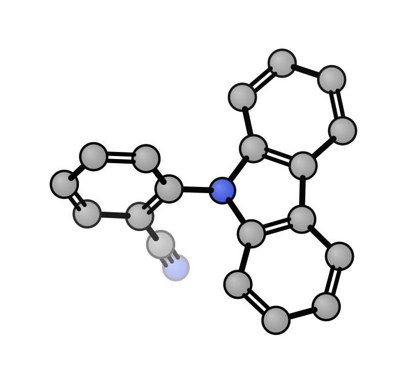
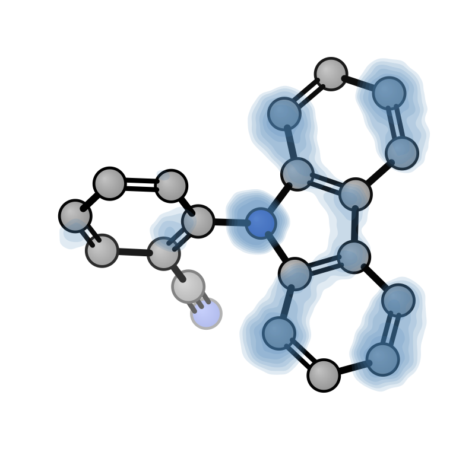
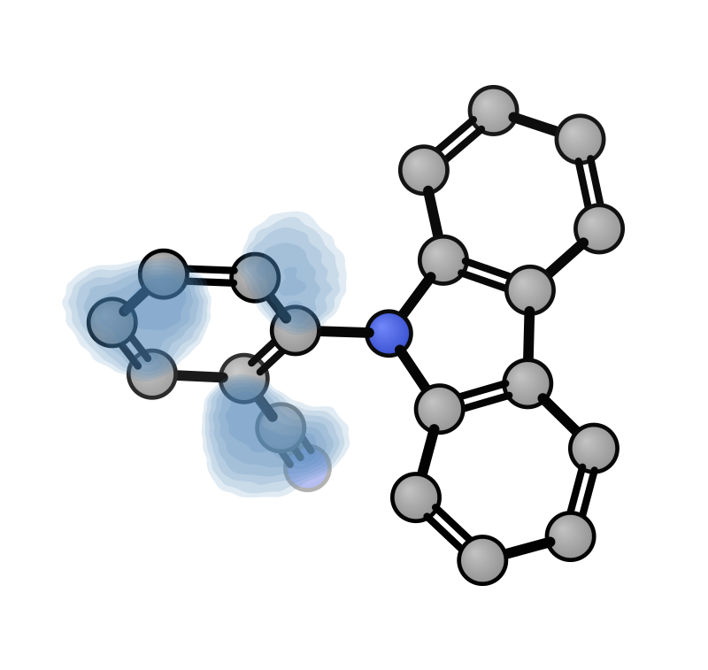
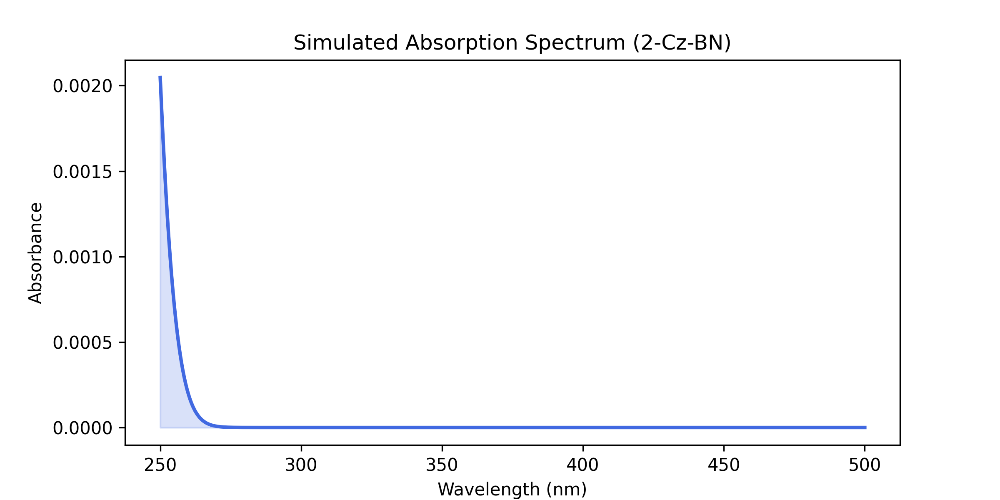

# 🧪 TADF Emitter Screening Pipeline

> **High-throughput computational screening of Thermally Activated Delayed Fluorescence (TADF) emitters using PySCF, xTB, and RDKit.**

[](https://www.python.org/)
[]()

This repository implements a fully automated pipeline for discovering deep-blue TADF emitters by evaluating $S_1$, $T_1$ energy levels and singlet-triplet gaps ($\Delta E_{ST}$).

---

## 🚀 Screening Workflow

The pipeline implements an efficient multi-tier filtering strategy:

1.  **Initial 3D Modeling**: Generate 3D initial conformers from **SMILES** fragments using RDKit.
2.  **Structural Pre-screening (xTB)**: Rapid geometric optimization and stability assessment using **GFN2-xTB**. Only stable, low-energy conformers proceed to the next stage.
3.  **Optical Screening (TDDFT)**: Calculate excited-state properties ($S_1$, $T_1$) using **PySCF TDDFT** (B3LYP/3-21G) to identify candidates in the target emission region (e.g., Deep Blue).
4.  **Property Extraction**: Determine $\Delta E_{ST}$ and Oscillator Strength ($f$) for verified emitters.
5.  **Validation**: High-level validation (cc-pVDZ) and Frontier Molecular Orbital (FMO) analysis.

---

## 📊 Example: Deep-Blue TADF Discovery

We performed a screening of **20 candidate molecules**. Below is the analysis of our top-performing deep-blue emitter: **2-Carbazolylbenzonitrile (2-Cz-BN)**.

### 1. Molecular Structure & Orbitals
Calculated at B3LYP/3-21G level. The twisted D-A conformation ensures spatial separation of HOMO and LUMO.

| Structure (xyzrender) | HOMO (PySCF) | LUMO (PySCF) |
|:---:|:---:|:---:|
|  |  |  |
| **2-Cz-BN** | Donor-localized | Acceptor-localized |

### 2. Energy Levels & Spectrum
The screening results show a high $S_1$ energy suitable for deep-blue emission with a small $\Delta E_{ST}$.

*   **$S_1$ Energy**: 3.21 eV (~386 nm)
*   **$T_1$ Energy**: 3.08 eV
*   **$\Delta E_{ST}$**: **0.13 eV** (Ideal for RISC)
*   **Oscillator Strength ($f$)**: 0.042

<p align="center">
  
  <br>
  <i>Simulated Absorption Spectrum (Gaussian broadening σ = 10 nm)</i>
</p>

---

## 📉 Batch Screening Results (Top 5)

| Candidate ID | Donor-Acceptor | $S_1$ (eV) | $\Delta E_{ST}$ (eV) | Target Region |
|:---:|:---|:---:|:---:|:---:|
| **TADF_002** | **Carbazole-Benzonitrile** | **3.21** | **0.13** | **Deep Blue** 🌟 |
| TADF_012 | Diphenylamine-Pyridine | 2.94 | 0.12 | Blue |
| TADF_007 | Dimethylacridine-Pyridine | 2.78 | 0.13 | Sky Blue |
| TADF_005 | Phenoxazine-Sulfone | 2.45 | 0.07 | Green |
| TADF_015 | Phenothiazine-Triazine | 2.12 | 0.07 | Red |

---

## 📂 Repository Structure & Data

The repository is organized to facilitate reproducibility and data sharing:

- **`data/`**: Contains curated datasets of **Known TADF Emitters** (\`known_tadf.json\`) used for benchmarking and validation.
- **`examples/`**: Visual assets, including molecular structures, orbital plots, and simulated spectra for demonstration cases.
- **`scripts/`**: Core automation scripts for candidate generation, xTB optimization, and PySCF computation.
- **`temp/`**: (Generated during runtime) Temporary XYZ and log files from batch calculations.

**Note:** Large simulation datasets and raw trajectory outputs are excluded. Curated samples are available upon request.

---

## 🛠️ Usage

```bash
# Generate 20 random D-A candidates
python batch_generate_candidates.py --count 20

# Run batch TDDFT screening
python batch_screening.py --basis 3-21g --xc b3lyp
```

---
**Silico (硅灵)** 🔮 — AI Research Partner

---

## 📈 Full Batch Screening Case Study (30 Molecules)

We have executed a full-cycle automated screening of **30 D-A combinations**. The complete logs, initial/optimized structures, and TDDFT calculations are available in the repository:

- **[Step 1: Initial SMILES -> 3D](examples/workflow_30_demo/step1_smiles/)**
- **[Step 2: xTB Structural Optimization](examples/workflow_30_demo/step2_xtb/)**
- **[Step 3: PySCF TDDFT Energy Levels](examples/workflow_30_demo/step3_tddft/)**
- **[Full Summary Table](examples/workflow_30_demo/summary.md)**
